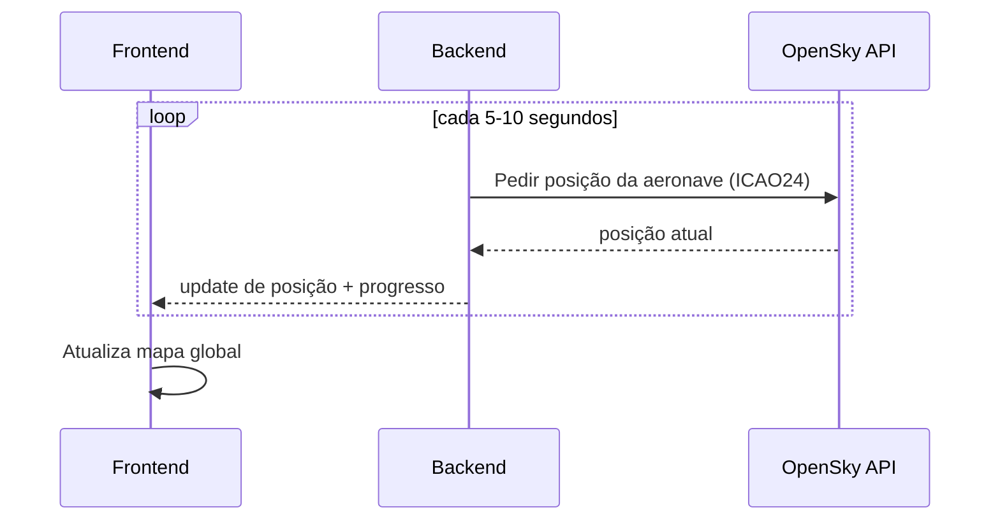

# Liftoff - Immersive Study Sessions

> Plataforma de sessões de estudo imersivas com ambiente de voo, mapa de lugares em tempo real e sincronização social.

## Sobre o Projeto

**Liftoff** é uma aplicação web criada para proporcionar uma experiência de estudo focada e colaborativa.  
A aplicação transforma uma sessão de estudo tradicional numa viagem virtual, onde os utilizadores entram numa cabine de estudo, escolhem um lugar, activam ambientes sonoros e acompanham uma sessão com duração definida até à "aterragem".  
O projeto combina produtividade, experiência imersiva e funcionalidades em tempo real utilizando comunicação por WebSockets.

### Stack:

 

 


---

## Funcionalidades Principais

### Sessões de Estudo

- Criação de sessões com duração configurável;
- Temporizador global sincronizado;
- Gestão do estado da sessão:
  - Preparação;
  - Em voo;
  - Aterragem concluída.

---

### Mapa de Lugares em Tempo Real

- Representação visual da cabine;
- Visualização dos lugares disponíveis;
- Escolha e reserva de lugares;
- Actualização imediata quando um lugar é ocupado;
- Prevenção de conflitos entre utilizadores.

---

### Sincronização em Tempo Real

Comunicação através de WebSockets para manter todos os participantes sincronizados:

- Entrada e saída de utilizadores;
- Actualização do mapa de lugares;
- Sincronização do temporizador;
- Alterações do estado da sessão.

---

### Áudio Ambiente

Integração com Web Audio API para criar ambientes de concentração:

- Sons de cabine de avião;
- Ruído ambiente;
- Sons personalizados;
- Controlo de reprodução pelo utilizador.

---

### Presença Social

Os participantes conseguem visualizar:

- Utilizadores presentes na sessão;
- Lugares ocupados;
- Estado da sessão;
- Número de participantes activos.

---

## Flight Tracking (Modo Simplificado)

O sistema de tracking foi simplificado para uma abordagem baseada em **uma única API (OpenSky)** e cálculo interno de tempo estimado.

O objetivo é:

- mostrar aeronaves próximas de um aeroporto
- permitir ao utilizador selecionar uma aeronave
- iniciar uma sessão de tracking
- calcular um tempo estimado até aterragem
- encerrar a sessão automaticamente no “landing”

---

## Arquitetura do sistema de tracking

```mermaid
flowchart TD

U[Utilizador] --> FE[Frontend Liftoff]

FE --> API[Backend .NET / C# API]

API --> OS[OpenSky Network API]

API --> CALC[Engine de Cálculo ETA]

API --> DB[(PostgreSQL)]

FE --> MAP[Mapa Leaflet / Mapbox]

API --> WS[WebSockets / Polling]

WS --> FE
````

---

## Fluxo: Seleção de aeronave

```mermaid
sequenceDiagram
participant U as Utilizador
participant FE as Frontend
participant API as Backend
participant OS as OpenSky
participant CALC as ETA Engine

U->>FE: Abre mapa de aeronaves
FE->>API: GET /aircraft/nearby?airport=LPPR
API->>OS: Pedir aeronaves ativas
OS-->>API: Lista de aviões
API->>API: Filtra aeronaves elegíveis
API-->>FE: Lista final

U->>FE: Seleciona aeronave (ICAO24)
FE->>API: POST /session/start
API->>CALC: calcular ETA
CALC-->>API: tempo estimado até aterragem
API-->>FE: sessão ativa + countdown
```

---

## Fluxo: Tracking em tempo real



---

## Cálculo de ETA (núcleo do sistema)

O tempo até aterragem é calculado internamente com base em:

* distância ao aeroporto
* altitude atual
* velocidade horizontal
* taxa média de descida assumida

### Fórmula conceptual:

* `t_horizontal = distância / velocidade`
* `t_vertical = altitude / taxa_descida`
* `ETA = max(t_horizontal, t_vertical) + buffer`

---

## Mapeamento de Dados

| Entidade              | Fonte           |
| --------------------- | --------------- |
| Aeronave (ICAO24)     | OpenSky Network |
| Posição em tempo real | OpenSky Network |
| ETA (calculado)       | Engine interno  |

---

## Limitações

* ETA é estimado (não baseado em plano de voo real)
* precisão depende da qualidade dos dados OpenSky
* não existe informação de voo comercial (flight number)

---

## Possíveis funcionalidades adicionais

* Tempo total estudado;
* Número de sessões concluídas;
* Histórico de estudo;
* Análise de produtividade;
* Dias consecutivos de estudo;
* Objectivos pessoais;
* Recompensas por consistência;
* Ranking entre utilizadores.

---

## Executar o projeto

### Local (.net)

```bash
dotnet watch run
```

A aplicação ficará disponível em:

[http://localhost:8080](http://localhost:8080)

### Atenção: 
antes de rodar localmente, passar:
  "DefaultConnection": "Host=postegres;Port=5432;Database=liftoff;Username=postgres;Password=fcaf987"
para: 
  "DefaultConnection": "Host=localhost;Port=5432;Database=liftoff;Username=postgres;Password=fcaf987"~
em appsettings.json 
---

### Docker (recomendado)

```bash
docker compose up --build
```

A aplicação ficará disponível em:

[http://localhost:8080](http://localhost:8080)

A base de dados PostgreSQL é iniciada automaticamente.

---

## Diferença de comandos: Local vs Docker

### Migrations e EF Core

| Ação               | Local                           | Docker                                                  |
| ------------------ | ------------------------------- | ------------------------------------------------------- |
| Criar migration    | `dotnet ef migrations add Nome` | `docker exec -it liftoff dotnet ef migrations add Nome` |
| Aplicar migrations | `dotnet ef database update`     | `docker exec -it liftoff dotnet ef database update`     |
| Remover migration  | `dotnet ef migrations remove`   | `docker exec -it liftoff dotnet ef migrations remove`   |


---
